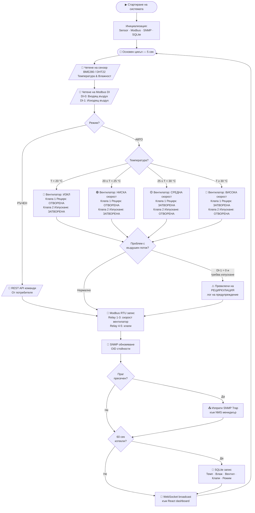
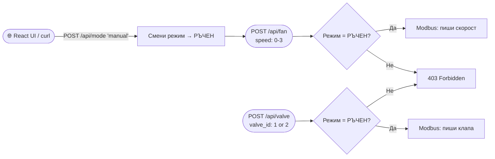
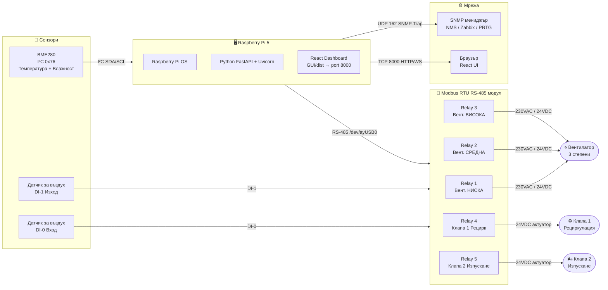

# Процесна диаграма — Разпределена вградена система за термично управление на ЦД

## Основен управляващ цикъл (всеки 5 секунди)

---

## REST API — ръчни команди (втори поток)

---

## Хардуерна блок-схема

